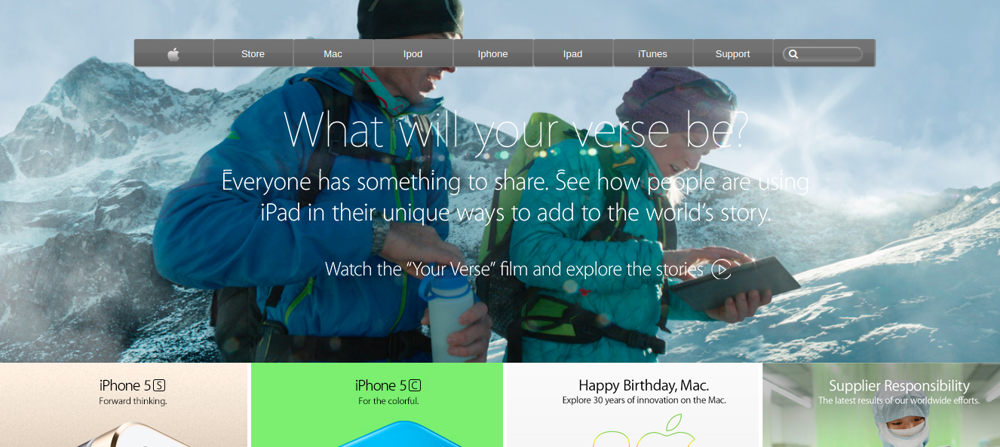

# Apple Website - Project: Building with Backgrounds and Gradients

This project is based on this <a href="https://web.archive.org/web/20140301004610/http://www.apple.com/">apple site</a> , as a part of the assignment for microverse using concepts of html and css, to create the site.

## Built With

- HTML5
- CSS3

## Authors

👤 **Gonza Javier Mancilla**

- Github: [@github/gonjavi](https://github.com/gonjavi)
- Linkedin: [linkedin](https://www.linkedin.com/in/g-javier-mancilla-a686a9178/)

## Live Demo

[Live Demo Link]()

## 🤝 Contributing

Contributions, issues and feature requests are welcome!

## Show your support

Give a ⭐️ if you like this project!

## 📝 License

This project is [MIT](lic.url) licensed.

